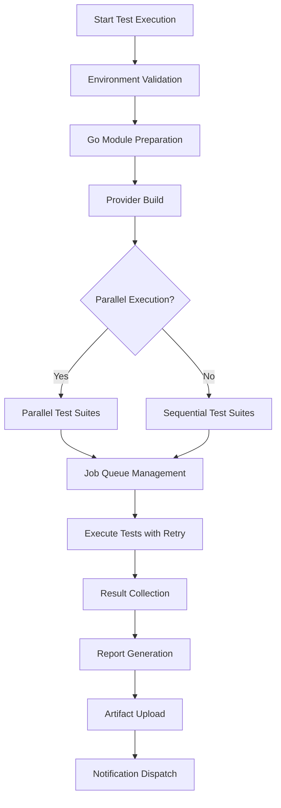

# Automated Test Execution with HashiCorp-Style Reporting

This document describes the comprehensive automated test execution infrastructure for the prettyjson Terraform provider, featuring HashiCorp-style reporting, parallel execution, intelligent retry mechanisms, and CI/CD integration.

## Overview

The automated test execution system provides a robust, scalable testing infrastructure that follows HashiCorp best practices for Terraform provider development. It includes:

- **Automated Test Execution Pipeline**: Comprehensive test orchestration with error handling
- **HashiCorp-Style Reporting**: Structured reports compatible with CI/CD systems
- **Parallel Execution**: Advanced parallel processing with load balancing
- **Intelligent Retry Logic**: Exponential backoff with circuit breakers
- **CI/CD Integration**: GitHub Actions workflows with artifact management

## Architecture

### Core Components

1. **automated-test-execution.sh**: Main test execution pipeline
2. **test-result-aggregator.sh**: Result aggregation and reporting system
3. **enhanced-parallel-executor.sh**: Advanced parallel execution engine
4. **GitHub Actions Workflows**: CI/CD integration
5. **Makefile Targets**: Development workflow integration

### Test Execution Flow



## Test Suites

The system supports multiple test suite types:

### Available Test Suites

| Suite | Description | Duration | TF_ACC Required |
|-------|-------------|----------|----------------|
| **unit** | Fast unit tests without Terraform | ~30s | No |
| **acceptance** | Terraform acceptance tests | ~2-5min | Yes |
| **function** | Provider function specific tests | ~1-2min | Yes |
| **integration** | End-to-end integration tests | ~3-10min | Yes |
| **version** | Terraform version compatibility | ~5-15min | Yes |
| **platform** | Cross-platform compatibility | ~2-8min | No |
| **performance** | Performance and benchmark tests | ~5-20min | Yes |

### Test Suite Configuration

Test suites can be configured in several ways:

```bash
# Individual test suites
make test-automated --suites "unit"
make test-automated --suites "unit,acceptance"

# Predefined combinations
make test-automated-quick           # unit + acceptance
make test-automated-comprehensive   # all suites with performance optimization
```

## Automated Test Execution Pipeline

### Basic Usage

```bash
# Run standard automated test suite
make test-automated

# Quick test suite for development
make test-automated-quick

# Comprehensive test suite with all features
make test-automated-comprehensive
```

### Advanced Usage

```bash
# Custom configuration
./scripts/platform-tests/automated-test-execution.sh \
  --suites "unit,acceptance,function" \
  --parallel 4 \
  --retry 3 \
  --timeout 30m \
  --generate-report \
  --performance-optimization

# Quick CI testing
./scripts/platform-tests/automated-test-execution.sh \
  --suites "unit,acceptance" \
  --parallel 2 \
  --timeout 15m \
  --fail-fast

# Comprehensive testing with all features
./scripts/platform-tests/automated-test-execution.sh \
  --suites "unit,acceptance,function,integration,performance" \
  --parallel 8 \
  --generate-report \
  --upload-artifacts \
  --slack-webhook "https://hooks.slack.com/services/..."
```

### Configuration Options

| Option | Description | Default |
|--------|-------------|---------|
| `--suites` | Comma-separated test suites | unit,acceptance,function,integration |
| `--parallel` | Number of parallel jobs | 4 |
| `--retry` | Maximum retry attempts | 3 |
| `--timeout` | Test timeout | 30m |
| `--fail-fast` | Stop on first failure | disabled |
| `--generate-report` | Generate comprehensive reports | enabled |
| `--performance-optimization` | Enable performance features | disabled |
| `--upload-artifacts` | Upload test artifacts | disabled |
| `--slack-webhook` | Slack notification webhook | none |

## Parallel Execution and Load Balancing

### Enhanced Parallel Executor

The system includes an advanced parallel execution engine with:

- **Load Balancing**: Intelligent job distribution across workers
- **Adaptive Parallelism**: Dynamic adjustment based on system resources
- **Circuit Breakers**: Failure pattern detection and prevention
- **Resource Monitoring**: CPU, memory, and load tracking

```bash
# Basic parallel execution
./scripts/platform-tests/enhanced-parallel-executor.sh \
  --max-parallel 8

# Advanced features
./scripts/platform-tests/enhanced-parallel-executor.sh \
  --max-parallel 8 \
  --load-balancing \
  --adaptive-parallelism \
  --resource-monitoring \
  --failure-correlation \
  --performance-optimization
```

### Retry Mechanisms

#### Retry Strategies

1. **Linear Backoff**: `delay = base_delay * attempt`
2. **Exponential Backoff**: `delay = base_delay * (2 ^ attempt)` (default)
3. **Fixed Delay**: `delay = base_delay`

#### Configuration

```bash
# Exponential backoff with jitter
./scripts/platform-tests/enhanced-parallel-executor.sh \
  --retry-backoff exponential \
  --jitter 0.2 \
  --retry-count 5

# Circuit breaker configuration
./scripts/platform-tests/enhanced-parallel-executor.sh \
  --circuit-breaker 0.7 \
  --failure-correlation
```

## Result Aggregation and Reporting

### HashiCorp-Style Reporting

The result aggregation system generates multiple report formats:

```bash
# Basic aggregation
make aggregate-test-results

# Comprehensive analysis
make aggregate-test-results-comprehensive

# Custom aggregation
./scripts/platform-tests/test-result-aggregator.sh \
  --formats json,markdown,junit,github \
  --include-logs \
  --performance-metrics \
  --threshold 85
```

### Report Formats

| Format | Description | Use Case |
|--------|-------------|----------|
| **JSON** | Structured data with full details | API integration, further processing |
| **Markdown** | Human-readable documentation | GitHub README, documentation |
| **JUnit XML** | Standard CI/CD format | Jenkins, Azure DevOps, other CI systems |
| **GitHub** | GitHub Actions summary format | PR comments, step summaries |
| **Slack** | Slack-formatted messages | Team notifications |
| **HTML** | Interactive dashboard | Detailed analysis, presentations |

### Example Report Structure

```json
{
  "summary": {
    "total_suites": 4,
    "successful_suites": 3,
    "failed_suites": 1,
    "suite_success_rate": 75,
    "total_tests": 25,
    "passed_tests": 23,
    "failed_tests": 2,
    "overall_success_rate": 92,
    "threshold_met": true
  },
  "suite_details": [
    {
      "suite_name": "unit",
      "status": "success",
      "total_tests": 8,
      "success_rate": 100,
      "duration_seconds": 45
    }
  ]
}
```

## CI/CD Integration

### GitHub Actions Workflows

#### Automated Test Execution Workflow

The main workflow (`.github/workflows/automated-test-execution.yml`) provides:

- **Multi-trigger Support**: PR, push, schedule, manual dispatch
- **Matrix Testing**: Multiple Terraform versions
- **Dynamic Configuration**: Test suite selection based on trigger
- **Artifact Management**: Test reports and coverage data
- **PR Integration**: Automatic comments with results

#### Trigger Configuration

| Trigger | Test Suites | Parallelism | Strategy |
|---------|-------------|-------------|----------|
| **Pull Request** | unit, acceptance, function | 4 | Quick validation |
| **Push to Main** | unit, acceptance, function, integration | 4 | Standard testing |
| **Scheduled** | All suites + performance | 8 | Comprehensive testing |
| **Manual Dispatch** | Configurable | Configurable | Custom testing |

#### Example Usage

```yaml
# Trigger comprehensive testing
on:
  workflow_dispatch:
    inputs:
      test_suites:
        description: 'Test suites to run'
        default: 'unit,acceptance,function,integration'
        type: choice
      parallel_jobs:
        description: 'Number of parallel jobs'
        default: '4'
        type: choice
```

### Makefile Integration

#### CI/CD Targets

```bash
# Quick CI testing (for PRs)
make ci-test-quick

# Standard CI testing (for pushes)
make ci-test-standard

# Comprehensive CI testing (for releases)
make ci-test-comprehensive
```

#### Validation Targets

```bash
# Validate test infrastructure
make validate-test-infrastructure

# Generate comprehensive test report
make generate-test-report

# Show help for automated testing
make help-automated
```

## Performance Optimization

### System Resource Management

The system includes comprehensive resource monitoring:

```bash
# Enable resource monitoring
./scripts/platform-tests/enhanced-parallel-executor.sh \
  --resource-monitoring \
  --adaptive-parallelism
```

### Performance Metrics

- **Execution Time Tracking**: Per-test and per-suite timing
- **Resource Usage**: CPU, memory, and load monitoring
- **Parallel Efficiency**: Worker utilization and load balancing
- **Retry Analysis**: Failure patterns and retry effectiveness

### Optimization Features

1. **Adaptive Parallelism**: Adjusts based on system load
2. **Load Balancing**: Distributes work evenly across workers
3. **Circuit Breakers**: Prevents cascade failures
4. **Resource Throttling**: Manages system resource usage

## Troubleshooting

### Common Issues

#### 1. Test Execution Failures

```bash
# Check test infrastructure
make validate-test-infrastructure

# Run with verbose output
./scripts/platform-tests/automated-test-execution.sh --verbose

# Check system resources
./scripts/platform-tests/enhanced-parallel-executor.sh \
  --resource-monitoring --dry-run
```

#### 2. Parallel Execution Problems

```bash
# Reduce parallelism
./scripts/platform-tests/automated-test-execution.sh --parallel 2

# Disable parallel execution
./scripts/platform-tests/automated-test-execution.sh --no-parallel

# Check resource usage
./scripts/platform-tests/enhanced-parallel-executor.sh \
  --resource-monitoring --verbose
```

#### 3. Report Generation Issues

```bash
# Validate test report directory
ls -la test-reports/

# Check JSON format
jq . test-reports/*.json

# Run aggregation with verbose output
./scripts/platform-tests/test-result-aggregator.sh --verbose
```

#### 4. CI/CD Integration Problems

```bash
# Test GitHub Actions locally (using act)
act -j automated-test-execution

# Validate workflow syntax
yq eval '.jobs' .github/workflows/automated-test-execution.yml

# Check environment variables
env | grep -E '^(TF_|GO_|GITHUB_)'
```

### Debug Mode

Enable detailed logging for troubleshooting:

```bash
# Automated execution debug
export DEBUG=1
./scripts/platform-tests/automated-test-execution.sh --verbose

# Parallel execution debug
./scripts/platform-tests/enhanced-parallel-executor.sh \
  --verbose --dry-run

# Result aggregation debug
./scripts/platform-tests/test-result-aggregator.sh \
  --verbose --threshold 0
```

### Log Analysis

#### Log Locations

- **Execution Logs**: `test-reports/execution.log`
- **Suite Logs**: `test-reports/{suite}-output.log`
- **Error Logs**: `test-reports/{suite}-errors.log`
- **Metrics**: `test-reports/metrics.log`

#### Log Analysis Commands

```bash
# View recent test execution
tail -f test-reports/execution.log

# Check for errors
grep -i error test-reports/*.log

# Analyze performance metrics
grep METRIC test-reports/execution.log | tail -20

# Check retry statistics
grep -i retry test-reports/execution.log
```

## Best Practices

### Development Workflow

1. **Local Testing**
   ```bash
   # Quick validation during development
   make test-automated-quick
   
   # Full validation before push
   make test-automated
   ```

2. **Performance Testing**
   ```bash
   # Regular performance checks
   make test-performance
   
   # Load balancing validation
   make test-load-balancing
   ```

3. **CI/CD Integration**
   ```bash
   # Validate CI configuration
   make validate-test-infrastructure
   
   # Generate comprehensive reports
   make generate-test-report
   ```

### Configuration Management

1. **Environment Variables**
   - Set `TF_ACC=1` for acceptance tests
   - Configure `TF_LOG` for debugging
   - Use `VERBOSE=1` for detailed output

2. **Resource Management**
   - Monitor system resources during testing
   - Adjust parallelism based on available resources
   - Use circuit breakers for failure-prone environments

3. **Reporting Configuration**
   - Set appropriate success thresholds
   - Configure notification webhooks
   - Enable trend analysis for long-term insights

### Security Considerations

1. **Sensitive Data**
   - Never log sensitive information
   - Use environment variables for credentials
   - Sanitize outputs in reports

2. **Resource Limits**
   - Set reasonable timeout values
   - Limit parallel execution count
   - Monitor resource usage

3. **Access Control**
   - Secure webhook URLs
   - Limit artifact retention
   - Control access to test reports

## References

- [Terraform Provider Testing](https://developer.hashicorp.com/terraform/plugin/testing)
- [terraform-plugin-testing Framework](https://developer.hashicorp.com/terraform/plugin/testing)
- [HashiCorp Provider Development Guidelines](https://developer.hashicorp.com/terraform/plugin/best-practices)
- [GitHub Actions Documentation](https://docs.github.com/en/actions)
- [Go Testing Package](https://pkg.go.dev/testing)

---

*This documentation covers the comprehensive automated test execution system for the prettyjson Terraform provider. For additional information, see the individual script documentation and inline comments.*